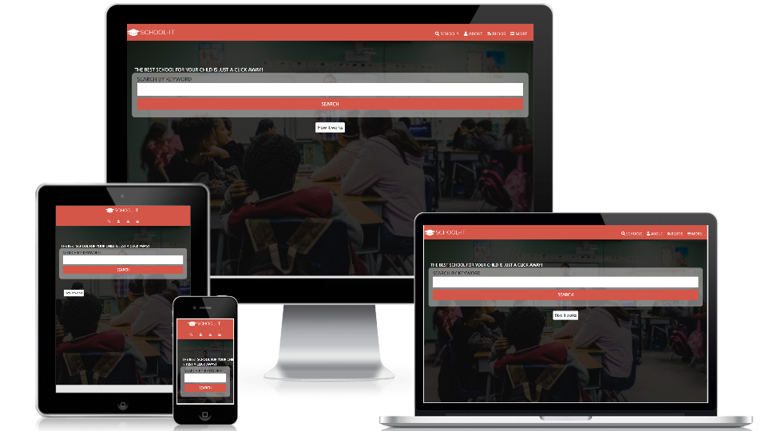

# SCHOOL IT (HTML & CSS CAPSTONE)

> This is a School directory website developed using HTML & CSS and Bootstrap 4.

## Built With

- HTML & CSS,
- Bootstrap 4
- CSS media queries, Flex box and Grid

## Design Idea By

[Mathew Njuguna and others on Behance]

## Live Demo

[Project Live Link](https://rawcdn.githack.com/SajjadAhmad14/SCHOOL-IT/ac511700221b6e7af8fe4a8059706328f40cf35d/index.html)

## Presentation Video

[Video Link](https://www.loom.com/share/aa92388fee8d4142a5cd59425e729538)

## Get The Project Code

**You are Welcomed To Clone The Project And Contribute To It**
**Go To https://github.com/SajjadAhmad14/SCHOOL-IT**

## Authors

👤 **Sajjad Ahmad**

- Github: [@githubhandle](https://github.com/SajjadAhmad14)
- Twitter: [@twitterhandle](https://twitter.com/Sajjad_Ahmad14)
- Linkedin: [linkedin](https://www.linkedin.com/in/sajjad-ahmad-86102117a/)

## 🤝 Contributing

Contributions, issues and feature requests are welcome!

Feel free to check the [issues page](https://github.com/SajjadAhmad14/SCHOOL-IT/issues).

## Show your support

Give a ⭐️ if you like this project!
